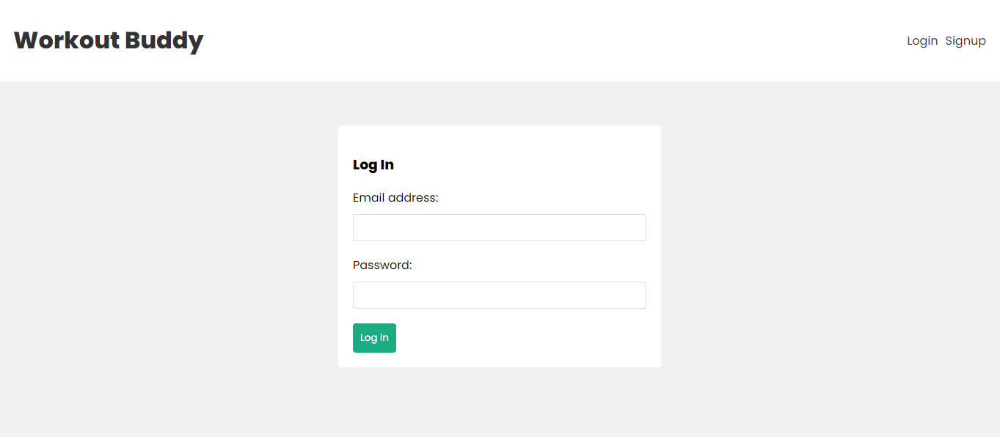
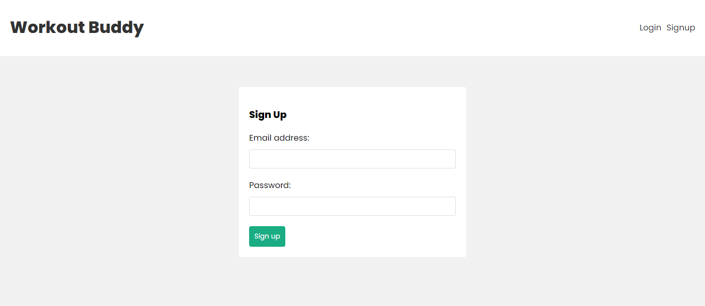
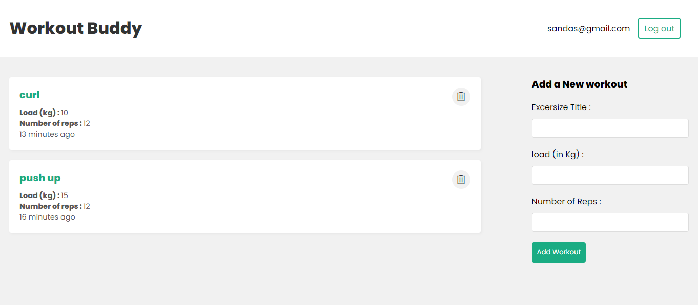
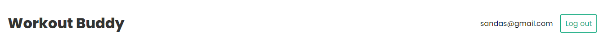
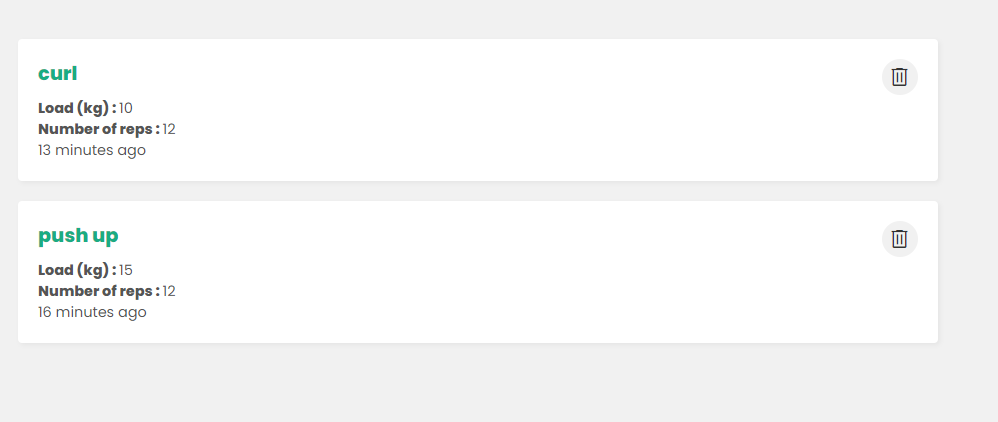
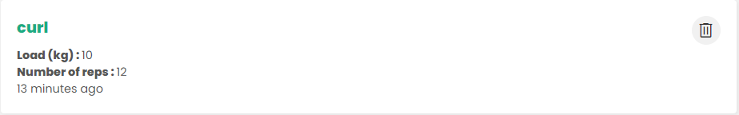
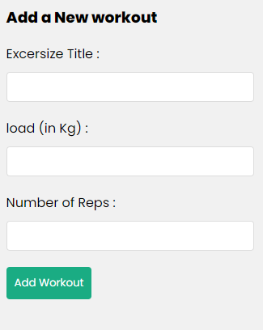

# Workout Buddy

Welcome to **Workout Buddy**! This repository contains the complete source code for the **Workout Buddy** application, a MERN stack project designed to help users manage their workout schedules. The application allows users to add, store, view, and delete workout schedules. Users need to log in with their email and password to access the features. If users do not have an account, they can create one using the signup functionality.

## Table of Contents

- [Features](#features)
- [Tech Stack](#tech-stack)
- [Installation](#installation)
- [Usage](#usage)
- [Contact](#contact)

## Features

- **User Authentication**: Users can sign up and log in using their email and password.
- **Add Workouts**: Authenticated users can add new workout schedules.
- **View Workouts**: Users can view their workout schedules.
- **Delete Workouts**: Users can delete their workout schedules.

## Tech Stack

- **Frontend**: React.js
- **Backend**: Node.js, Express.js
- **Database**: MongoDB
- **Authentication**: JWT (JSON Web Token)
- **Styling**: CSS

## Installation

Follow these steps to get a local copy of the project up and running.

### Prerequisites

- Node.js
- MongoDB

### Clone the Repository

```bash
git clone https://github.com/sandazz/Workout-Buddy-MERN-Project.git
cd Workout-Buddy-MERN-Project
```

### Backend Setup

1. Navigate to the backend directory:

    ```bash
    cd backend
    ```

2. Install backend dependencies:

    ```bash
    npm install
    ```

3. Create a `.env` file in the backend directory and add the following environment variables:

    ```plaintext
    PORT=your_port_number
    MONGO_URI=your_mongodb_uri
    JWTSECRET=your_jwt_secret
    ```

4. Start the backend server:

    ```bash
    node server.js
    ```

### Frontend Setup

1. Open a new terminal and navigate to the frontend directory:

    ```bash
    cd fronted
    ```

2. Install frontend dependencies:

    ```bash
    npm install
    ```

3. Start the frontend development server:

    ```bash
    npm start
    ```

## Usage

1. Open your browser and navigate to `http://localhost:3000`.
2. Sign up for a new account or log in with your existing credentials.
3. Start managing your workout schedules!

## User Interfaces
1. Log in

2. Sign up

3. Home page

4. Navbar

5. Workouts View

6. Workout

7. Add workout


Thank you for using Workout Buddy! Net Ninja!
